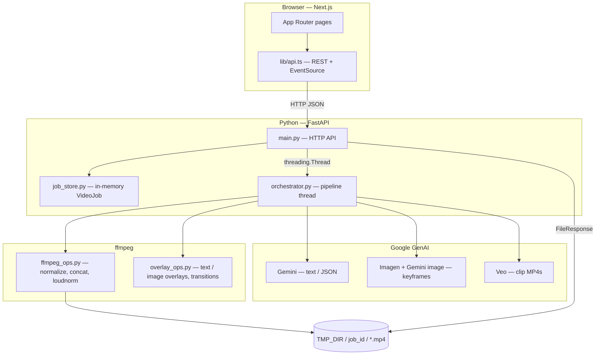
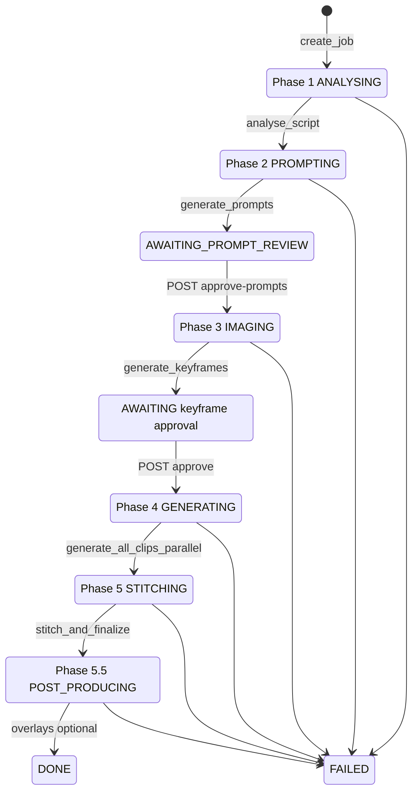

# Flash Tool — System Design

This document describes the **flash-tool** application: architecture, end-to-end pipeline, orchestration, external integrations, and a consolidated review of **security posture** and **known defects**.

---

## 1. Purpose

**flash-tool** turns a raw Hindi/Hinglish ad script into a short vertical (9:16 by default) video ad. It uses Google **Gemini** (analysis, prompts, verification), **Imagen** / **Gemini image** (keyframes), **Veo** (per-clip video), and **ffmpeg** (normalize, stitch, loudness, CTA, overlays).

Human-in-the-loop gates exist **after Phase 2** (clip prompt review) and **after Phase 3** (keyframe image review) before expensive video generation.

---

## 2. High-Level Architecture

**Runtime split**

| Layer | Technology | Notes |
|--------|------------|--------|
| Frontend | Next.js (App Router), client components | Calls backend via `NEXT_PUBLIC_API_URL`; SSE for live progress |
| Backend | FastAPI, `uvicorn`, background `threading.Thread` | No separate queue worker; pipeline runs in-process |
| State | `JobStore` — `dict[job_id, VideoJob]` + `threading.RLock` | Ephemeral: lost on restart |
| Events | `_job_event_queues[job_id]` — append-only list | Polled by SSE handler; optional `Last-Event-ID` resume |
| Disk | `config.TMP_DIR` (default `/tmp/flash_tool`) | Per-job subdirectory; clips + finals |

---

## 3. Repository Layout (flash-tool)

| Path | Role |
|------|------|
| `backend/main.py` | FastAPI app: CORS, routes, SSE, file serving |
| `backend/config.py` | Env-driven settings (`GOOGLE_API_KEY`, models, `TMP_DIR`, etc.) |
| `backend/models.py` | Pydantic models: `VideoJob`, `CreateJobRequest`, phases, overlays |
| `backend/job_store.py` | CRUD for in-memory jobs |
| `backend/pipeline/orchestrator.py` | Phase sequencing, approval `threading.Event`s, `emit_event` |
| `backend/pipeline/phase1_analyser.py` | Script → `ProductionBrief` (Gemini + domain profiler) |
| `backend/pipeline/phase2_prompter.py` | Brief → per-clip Veo prompts + verifier |
| `backend/pipeline/phase3_imager.py` | Keyframes (Imagen frame 0, Gemini image edits) |
| `backend/pipeline/phase4_generator.py` | Parallel Veo clip generation |
| `backend/pipeline/phase5_stitcher.py` | Normalize, optional transitions, CTA, loudnorm |
| `backend/pipeline/domain_profiler.py` | Domain-specific visual markers |
| `backend/video/ffmpeg_ops.py` | Core ffmpeg subprocess helpers |
| `backend/video/overlay_ops.py` | Text/image overlays, generated transition clips |
| `backend/ai/*.py` | Thin clients: Gemini, Imagen, Veo |
| `frontend/app/*` | Pages: `/`, `/new`, `/jobs/[id]/…` |
| `frontend/lib/api.ts` | Typed fetch helpers + `EventSource` URL |
| `start.sh` | Installs deps, starts backend `:8020`, frontend `:3000` |

The repo root also contains `prompts.py`, `LowLevelDesign.md`, and `claude_code_prompts.md`; the **shipped app** for local dev is under **`flash-tool/`**.

---

## 4. Data Model (Conceptual)

- **`VideoJob`**: identity (`job_id`), `script_raw`, coach/aspect/domain, `status`, `phase`, `progress`, `production_brief`, `clips[]`, `keyframes[]` (including base64 JPEG in `image_b64`), `clip_paths[]`, `final_video_path`, `post_production`, timestamps.
- **`CreateJobRequest`**: script, coach, `num_clips` (3–8), aspect ratio, `veo_model`, optional `domain`, optional `PostProductionConfig` (transitions, text overlays, image overlays).
- **Gates**: `ApprovePromptsRequest` (empty body) unblocks Phase 3; `ApproveImagesRequest.approved_indices` marks keyframes approved and unblocks Phase 4.

---

## 5. Pipeline & Orchestration (Detail)

Orchestration is **synchronous inside one background thread** per job (`run_pipeline` in `orchestrator.py`). The HTTP layer only starts the thread and manipulates shared state/events.

### 5.1 Phase diagram

### 5.2 Phase responsibilities

| Phase | Status / phase enum | Work |
|-------|---------------------|------|
| **1** | `ANALYSING`, `PHASE_1` | `analyse_script()` → `production_brief` (character, clips, locked background, domain/coach clip, visual states) |
| **2** | `PROMPTING`, `PHASE_2` | `generate_prompts()` → `clips[]` with long Veo prompts + verification metadata |
| **2 review** | `AWAITING_PROMPT_REVIEW`, `PHASE_2_REVIEW` | Thread blocks on `_prompt_approval_events[job_id].wait()`. UI may `PUT /clips/{i}` to edit prompts, then `POST /approve-prompts` |
| **3** | `IMAGING`, `PHASE_3` | `generate_keyframes()` streams frames into store; SSE `keyframe_ready` per frame |
| **3 review** | `AWAITING` | Thread blocks on `_approval_events[job_id].wait()`. UI `POST /approve` with indices; `_approval_data` applied to `keyframes[].approved` |
| **4** | `GENERATING`, `PHASE_4` | `generate_all_clips_parallel()` — ThreadPoolExecutor, Veo per clip, paths under `TMP_DIR/job_id/` |
| **5** | `STITCHING`, `PHASE_5` | `stitch_and_finalize()` — normalize each clip, concat (+ optional transition inserts), trim, loudnorm, append CTA |
| **5.5** | `POST_PRODUCING`, `PHASE_5_5` | Optional text/image overlays via `overlay_ops`; skipped if no overlays |

### 5.3 Concurrency model

- **One daemon thread per job** running `run_pipeline`.
- **Phase 4** uses `ThreadPoolExecutor(max_workers=n)` where `n` = number of clips (bounded by `num_clips` 3–8).
- **Job store** updates use an `RLock` on the store; individual `VideoJob` fields are mutated from the pipeline thread and from async FastAPI handlers — **potential races** on nested mutable objects (e.g. lists) if a handler and pipeline touch the same job simultaneously; most gates reduce overlap by status checks.

### 5.4 Event / SSE flow

1. On job create, `main.py` ensures `_job_event_queues[job_id]` exists before starting the thread.
2. `emit_event(job_id, type, data)` appends `{"type", "data"}` to that list.
3. `GET /api/v2/jobs/{job_id}/stream` runs an async generator: yields new entries from `start_index` (from `Last-Event-ID` + 1), heartbeats every 15s, exits when job is `DONE` or `FAILED` after draining the queue.

### 5.5 Human approval mechanics

- **`_prompt_approval_events`**: set by `POST .../approve-prompts`; orchestrator unblocks into Phase 3.
- **`_approval_events` + `_approval_data`**: `POST .../approve` writes body to `_approval_data` then sets event; orchestrator applies approved flags and continues to Phase 4.
- **`finally` in `run_pipeline`**: pops approval events/data to limit memory leaks for finished jobs (SSE queue is **not** cleared here — grows per job for the process lifetime).

---

## 6. HTTP API Surface (v2)

| Method | Path | Purpose |
|--------|------|---------|
| GET | `/api/v2/health` | Liveness |
| GET | `/api/v2/jobs/list` | Dashboard summaries |
| POST | `/api/v2/jobs/create` | Create job + start pipeline thread |
| PUT | `/api/v2/jobs/{id}/post-production` | Update overlays/transitions (blocked near terminal states) |
| GET | `/api/v2/domains` | Domain dropdown data |
| GET | `/api/v2/jobs/{id}/status` | Snapshot |
| GET | `/api/v2/jobs/{id}/stream` | SSE progress |
| GET | `/api/v2/jobs/{id}/clips` | Clip prompts |
| PUT | `/api/v2/jobs/{id}/clips/{i}` | Edit prompt (only in `AWAITING_PROMPT_REVIEW`) |
| POST | `/api/v2/jobs/{id}/approve-prompts` | Unblock Phase 3 |
| GET | `/api/v2/jobs/{id}/keyframes` | Metadata only (no image bytes) |
| POST | `/api/v2/jobs/{id}/approve` | Unblock Phase 4 |
| POST | `/api/v2/jobs/{id}/clips/{i}/save-prompt` | Save prompt any time |
| POST | `/api/v2/jobs/{id}/regen-image` | Regenerate one keyframe (awaiting approval only) |
| POST | `/api/v2/jobs/{id}/regen-clip` | Regenerate one clip |
| POST | `/api/v2/jobs/{id}/restitch` | Re-run stitch from existing `clip_paths` |
| GET | `/api/v2/video/{job_id}/{filename}` | Serve MP4 from `TMP_DIR/job_id/` (basename-hardened) |
| GET | `/api/v2/keyframe/{job_id}/{index}` | JPEG bytes from in-memory base64 |

OpenAPI: `/docs` when the server is running.

---

## 7. Frontend ↔ Backend Contract

- **Base URL**: `NEXT_PUBLIC_API_URL` (see **§9.1** for default port mismatch).
- **REST**: JSON bodies; errors as HTTP status + text or JSON `detail`.
- **SSE**: Native `EventSource` to `/stream` (no custom headers — cannot send `Authorization` via standard EventSource without a proxy; relevant if auth is added later).

---

## 8. External Dependencies

| Dependency | Use |
|------------|-----|
| `GOOGLE_API_KEY` | Gemini, Imagen, Veo clients (`google.genai`) |
| ffmpeg / ffprobe | All video/audio processing |
| Noto Sans Devanagari (optional) | Hindi `drawtext` overlays; fallback font if missing |

---

## 9. Security & Privacy Review

This section records **issues suitable for a private beta / localhost tool**. Anything exposed beyond `127.0.0.1` should be hardened first.

### 9.1 Configuration / CORS / ports

- **No authentication or authorization.** Anyone who can reach the API can create jobs, list jobs, approve gates, read keyframes/videos, and trigger GPU/API-heavy work — **full data and quota exposure**.
- **Backend listens on `0.0.0.0:8020`** (`start.sh`), so the API is reachable on the LAN unless firewalled.
- **CORS `allow_origins`** is fixed to `http://localhost:3001` in `main.py`, while `start.sh` starts the frontend on **port 3000**. Browsers may block API calls unless the origin matches or CORS is updated.
- **Frontend fallback base URL** is `http://localhost:8000` in `lib/api.ts` and some pages, but the default backend port in this repo is **8020** — misconfiguration if `.env.local` is missing.

### 9.2 Secrets

- API keys load from **environment / `.env`** (`backend/config.py`). Root `.gitignore` and `frontend/.gitignore` include `.env` patterns — **do not commit real keys**.
- **`/api/v2/jobs/list` and `/status`** can return `error` strings that might contain stack traces or file paths from failures — **information leakage** for multi-user deployments.

### 9.3 Input handling & server-side risk

- **`CreateJobRequest.script`** has **no documented max length** — large payloads risk memory pressure and cost (Gemini input).
- **`PostProductionConfig.image_overlays[].image_path`** is a **server-local path** chosen by the client. A malicious client could point ffmpeg at **any readable file** the service user can open (limited by how ffmpeg uses the path — primarily file read for decode, not arbitrary shell). **Mitigation**: restrict to a dedicated assets directory or upload + store blobs under `TMP_DIR`.
- **Text overlays** embed user text into ffmpeg **filter graphs**. The code escapes `'` and `:`; other characters may still break filters or cause ffmpeg failures. **Subprocess uses argv lists** (not `shell=True`) in `ffmpeg_ops._run` — good mitigation against shell injection.
- **Video serving** uses `os.path.basename` on `job_id` and `filename` — **path traversal to parent directories is blocked** for that route.

### 9.4 Operational

- **Pipeline thread is `daemon=True`**: abrupt process shutdown can leave jobs half-done without clean teardown.
- **In-memory job store**: restart clears all jobs; **SSE history** for old jobs is gone.
- **Logging** is configured at **DEBUG** in `main.py` — verbose logs in shared environments may include sensitive prompt/script fragments.

---

## 10. Functional Bugs & Inconsistencies

| ID | Area | Description |
|----|------|-------------|
| B1 | `restitch` | `RestitchRequest.clip_indices` is accepted in the API but **not passed** into `stitch_and_finalize` — partial restitch is not implemented; clients sending indices get a misleading contract. |
| B2 | `regen-clip` | Uses `config.VEO_MODEL` hardcoded in `main.py`, while the main pipeline uses `CreateJobRequest.veo_model`. Regenerated clips may use a **different model** than the original run. |
| B3 | Defaults | `CreateJobRequest.veo_model` default (`veo-3.1-generate-preview`) vs `config.VEO_MODEL` default (`veo-2.0-generate-001`) can confuse operators who expect a single source of truth. |
| B4 | CORS / ports | Origin `3001` vs dev server `3000` (see §9.1). |
| B5 | Frontend BASE | Default `8000` vs backend `8020` (see §9.1). |

---

## 11. Resilience & Limits

- Veo clip generation implements **retries** with backoff (`phase4_generator.py`).
- **Content policy** errors from Veo are typed (`ContentPolicyError`) for cleaner failure modes.
- **Parallelism**: Phase 4 uses one executor sized to clip count; global `MAX_PARALLEL_WORKERS` in config is used elsewhere — worth confirming consistency under load.
- **Disk**: No automatic TTL cleanup of `TMP_DIR` job folders in the reviewed paths — long-running hosts may need a cron job.

---

## 12. Possible Hardening (Future)

- API keys: **Bearer token** or session between UI and backend; never expose `GOOGLE_API_KEY` to the browser (current design keeps it server-side — good).
- Bind backend to `127.0.0.1` for local-only dev; put a reverse proxy + TLS in production.
- Align CORS with actual dev origin; align default ports across `start.sh`, `lib/api.ts`, and README.
- Validate overlay paths; cap script size; rotate/redact error messages in list endpoints.
- Persist jobs (DB + object storage for artifacts) if you need durability or multi-instance.

---

## 13. Document History

| Version | Date | Notes |
|---------|------|--------|
| 1.0 | 2026-04-18 | Initial design + security/bug pass over `flash-tool` codebase |

This design reflects the code as of the review date; line-level behavior may drift — prefer the source for exact conditionals and edge cases.
